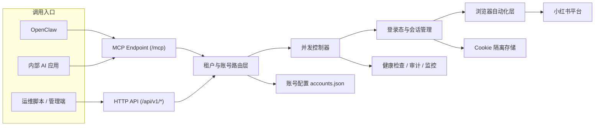
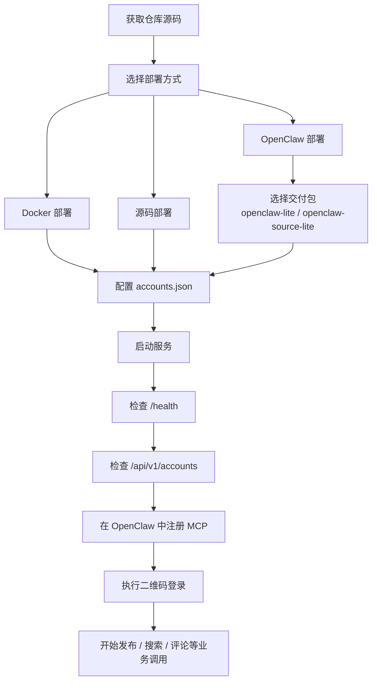

# xiaohongshuritter

`xiaohongshuritter` 是一个面向企业场景的小红书 MCP 系统，支持多租户、多账号、并发控制，以及 `Docker 部署`、`源码部署`、`OpenClaw 部署` 三种交付方式。

适用场景：
- 企业内部多个品牌、业务线共用一套小红书自动化服务
- 多个运营账号统一接入 MCP，由 AI 客户端按 `tenant_id` 和 `account_id` 路由调用
- 需要在 `Windows`、`macOS`、`Linux`、`Docker`、`OpenClaw` 等环境稳定部署
- 需要图文发布、视频发布、搜索、评论、资料查询等自动化能力

## 系统架构图



## 部署流程图



## 核心能力

- 多租户隔离：通过 `tenant_id` 区分企业、品牌或业务线
- 多账号路由：通过 `account_id` 管理同租户下多个账号
- 并发控制：支持全局并发和单账号并发上限
- MCP + HTTP API：同时提供 MCP 服务入口和 HTTP 管理接口
- 账号状态管理：支持登录检测、二维码登录、Cookie 隔离
- 多平台部署：支持标准 Docker、源码运行、OpenClaw 调用

## 功能概览

- 登录状态检查
- 登录二维码获取
- 图文笔记发布
- 视频笔记发布
- 推荐流获取
- 关键词搜索
- 笔记详情获取
- 评论与回复
- 当前账号列表和并发状态查询

## 部署方式

| 场景 | 推荐方式 | 文档 |
| --- | --- | --- |
| 标准服务器部署 | Docker | [docs/docker_deployment.md](./docs/docker_deployment.md) |
| 本地开发与二次开发 | 源码部署 | [docs/source_deployment.md](./docs/source_deployment.md) |
| OpenClaw 集成 | OpenClaw 部署 | [docs/openclaw_deployment.md](./docs/openclaw_deployment.md) |
| Apple Silicon | macOS M4 指南 | [docs/macos_m4_openclaw.md](./docs/macos_m4_openclaw.md) |
| Windows 企业环境 | Windows 指南 | [docs/windows_enterprise.md](./docs/windows_enterprise.md) |

## 快速开始

### 1. 准备账号配置

```bash
cp configs/accounts.enterprise.example.json configs/accounts.json
```

最小示例：

```json
{
  "default_tenant": "default",
  "default_account": "main",
  "global_max_concurrency": 12,
  "tenants": [
    {
      "id": "default",
      "default_account": "main",
      "accounts": [
        {
          "id": "main",
          "cookie_path": "./data/default/main/cookies.json",
          "max_concurrency": 3
        }
      ]
    }
  ]
}
```

### 2. 启动服务

Docker：

```bash
docker compose -f docker/docker-compose.yml up -d
```

源码：

```bash
go run .
```

### 3. 验证服务

```bash
curl http://127.0.0.1:18060/health
curl http://127.0.0.1:18060/api/v1/accounts
```

### 4. MCP 地址

```text
http://127.0.0.1:18060/mcp
```

## OpenClaw 调用示例

```json
{
  "tenant_id": "default",
  "account_id": "main",
  "title": "企业内容发布示例",
  "content": "支持多租户、多账号与并发发布。",
  "images": ["/app/images/demo.jpg"],
  "tags": ["内容运营", "企业发布"],
  "visibility": "公开可见"
}
```

## 交付包

仓库中包含适合 OpenClaw 和运维交付的包模板：

- [package/README.md](./package/README.md)
- [package/openclaw-lite/README.md](./package/openclaw-lite/README.md)
- [package/openclaw-source-lite/README.md](./package/openclaw-source-lite/README.md)

说明：
- `openclaw-lite` 适合标准 Docker / Linux amd64 环境
- `openclaw-source-lite` 适合 ARM64、Chromium 预置、OpenClaw 稳定交付

## 文档导航

- 企业级能力说明：[docs/enterprise_deployment.md](./docs/enterprise_deployment.md)
- HTTP API 文档：[docs/API.md](./docs/API.md)
- 企业 API 扩展：[docs/API_ENTERPRISE.md](./docs/API_ENTERPRISE.md)
- OpenClaw MCP 全量手册：[docs/OPENCLAW_MCP_USAGE.md](./docs/OPENCLAW_MCP_USAGE.md)
- Docker 部署：[docs/docker_deployment.md](./docs/docker_deployment.md)
- 源码部署：[docs/source_deployment.md](./docs/source_deployment.md)
- OpenClaw 部署：[docs/openclaw_deployment.md](./docs/openclaw_deployment.md)

## 参考项目说明

本项目在设计与实现上参考了开源项目 [xpzouying/xiaohongshu-mcp](https://github.com/xpzouying/xiaohongshu-mcp)，并在此基础上扩展了企业级多账号、多并发、OpenClaw 交付、Docker 与多平台部署等能力。

进一步说明见 [NOTICE.md](./NOTICE.md)。

## 开源协作

- 变更记录：[CHANGELOG.md](./CHANGELOG.md)
- 安全说明：[SECURITY.md](./SECURITY.md)
- 社区行为准则：[CODE_OF_CONDUCT.md](./CODE_OF_CONDUCT.md)
- 贡献说明：[CONTRIBUTING.md](./CONTRIBUTING.md)

## 合规提醒

请在账号授权、平台规则和当地法律法规允许的前提下使用本项目。涉及发布、评论、点赞等写操作时，建议接入审核、限流和审计流程。
